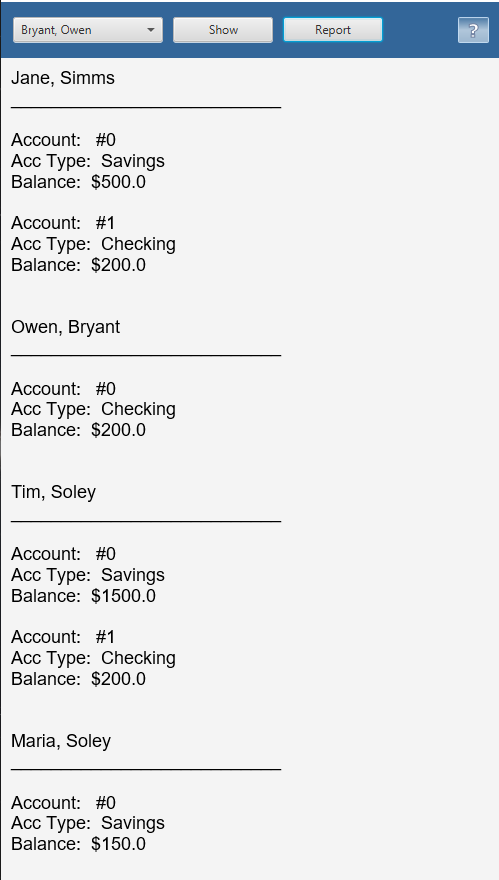
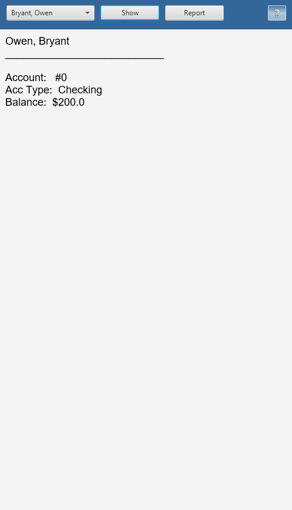

# UI Lab 5
# На "п'ять"
1. Додайте до форми кнопку Report, яка має виводити у нижній частині вікна звіт за клієнтами такого ж виду, як у роботі номер 8 (див. CustomerReport).
2. Запустіть проект, впевніться, що все працює як очікувалось. Продемонстрируйте результат викладачеві.

 
